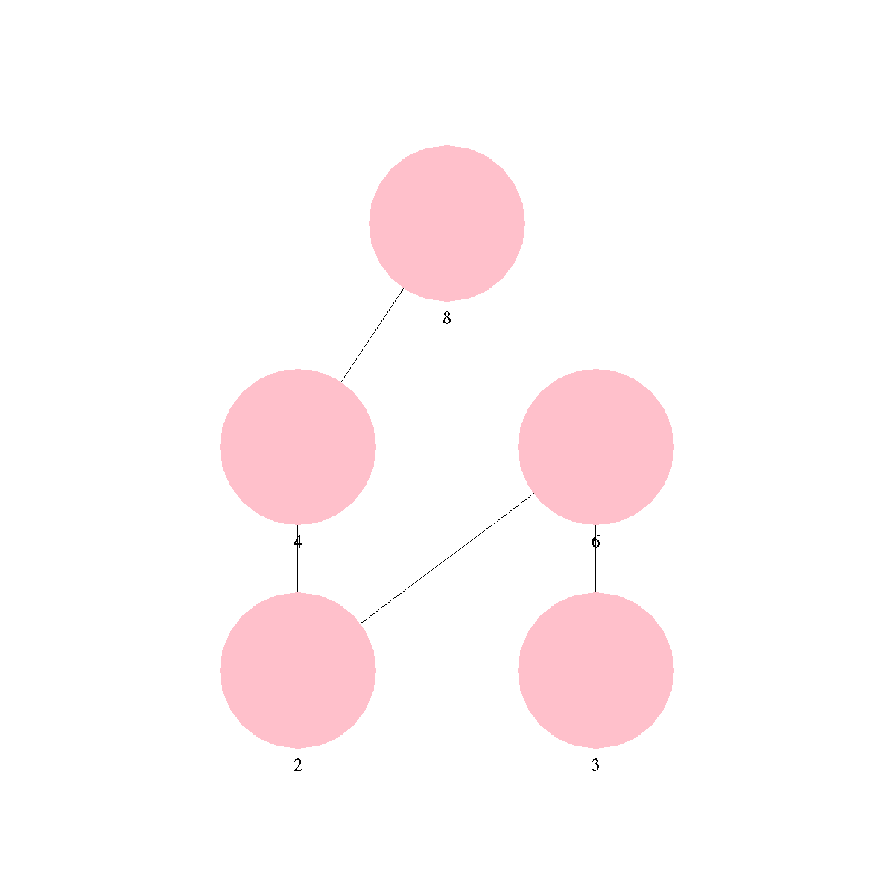

# HasseDiagram

Учебный командный проект на C++: построение и хранение диаграмм Хассе для разных типов данных, визуализация и практический пример применения для белковых последовательностей.



## Возможности

- Построение диаграмм Хассе для стандартных типов данных: `INT`, `STRING`, `SET_INT`, `POINT2D`.
- Поддержка собственного типа данных: достаточно описать правило сравнения.
- Визуализация диаграммы и сохранение результата в файлы `.png` и `.dot`.
- Построение дерева подпоследовательностей для выравнивания белковых аминокислотных последовательностей.
- Оценка схожести последовательностей по таблице замен BLOSUM62.

## Сборка и запуск

Нужны компилятор с поддержкой C++20, CMake 3.20 или новее и библиотеки OpenGL, GLFW и GLUT.

Установка зависимостей:

```
# Ubuntu / Debian
sudo apt install build-essential cmake libglfw3-dev freeglut3-dev

# macOS
brew install cmake glfw
```

Сборка и запуск:

```
git clone https://github.com/evgehadov/HasseDiagram.git
cd HasseDiagram
cmake -S . -B build
cmake --build build
./build/HasseDiagram
```

Программа работает через консоль. Результаты сохраняются в папку `Graph/`.

## Структура проекта

```
.
├── Graph/                 # сохранённые визуализации
├── ITypeHandler.h         # абстрактный класс для работы со всеми типами
├── SimpleTypeHandler.h    # реализация для базовых типов
├── HasseBuilder.h         # получение рёбер по правилам сравнения
├── HasseDiagram.h         # класс диаграммы Хассе
├── TypeRegistry.h         # реестр доступных типов для выбора в консоли
├── AminoAcids.h           # работа с аминокислотными остатками
├── AppCommon.h            # консольный ввод-вывод и действия пользователя
├── Draw.h                 # визуализация и сохранение диаграмм
├── Tests.h                # тесты для разных типов данных
├── BLOSUM62.csv           # таблица замен для белковых последовательностей
├── stb_image_write.h      # сторонняя библиотека для записи PNG (stb)
├── CMakeLists.txt         # сборка проекта
├── main.cpp               # точка входа
└── README.md
```

## Авторы

Проект выполнен вдвоём с [@MaryEremikhina](https://github.com/MaryEremikhina).

- **Евгения Довгер:** абстрактный интерфейс типов (`ITypeHandler.h`), реализация базовых типов (`SimpleTypeHandler.h`), класс диаграммы (`HasseDiagram.h`), построитель рёбер (`HasseBuilder.h`), тесты (`Tests.h`).
- **Соавтор:** логика, связанная с биоинформатикой (выравнивание белковых последовательностей).

Библиотека `stb_image_write.h` принадлежит авторам [stb](https://github.com/nothings/stb).
